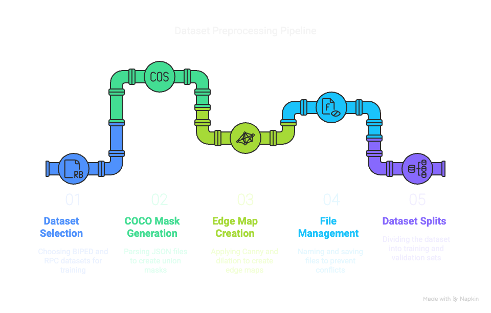
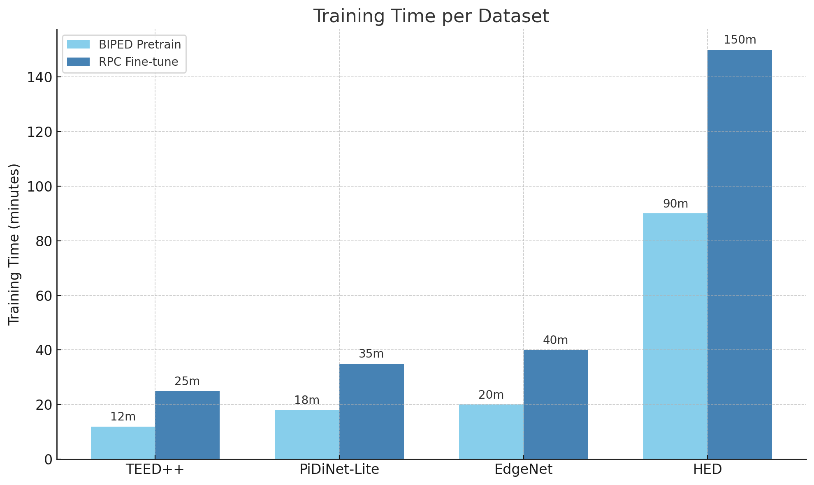
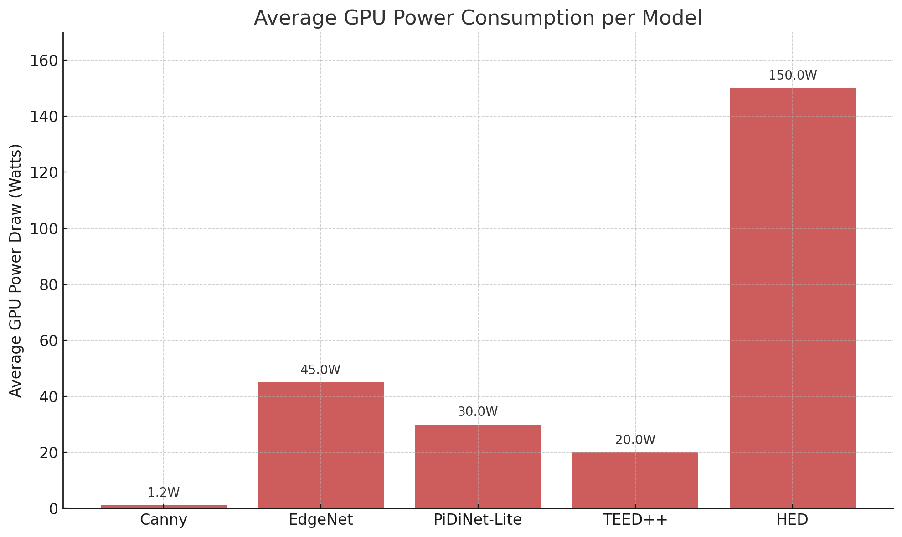
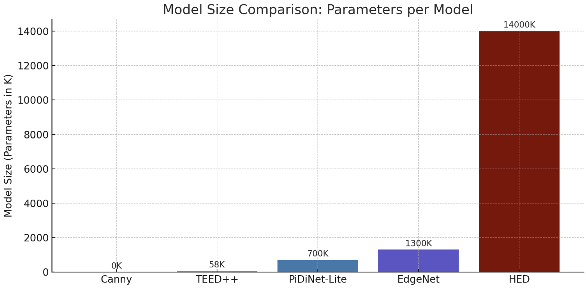
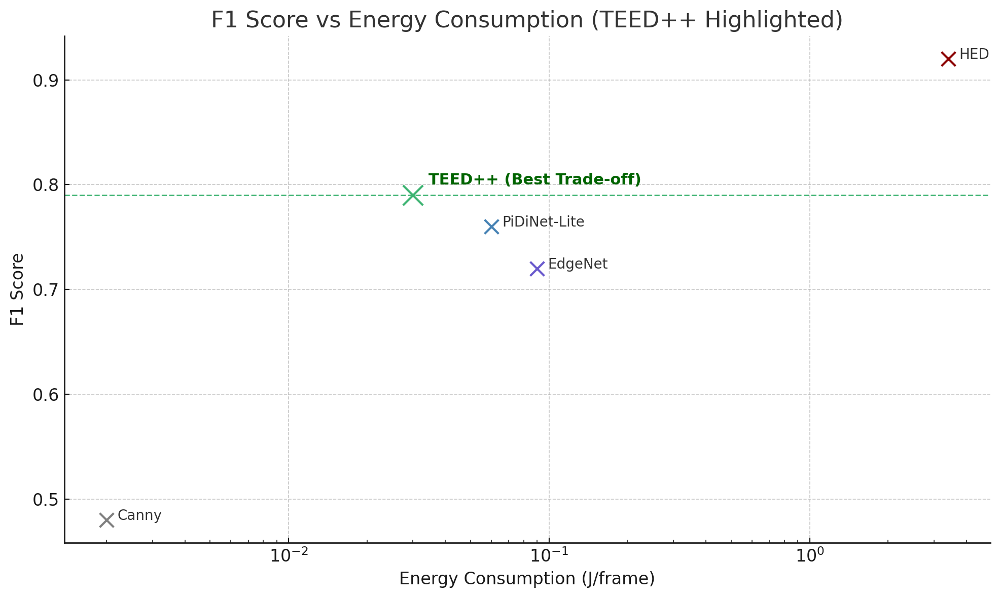
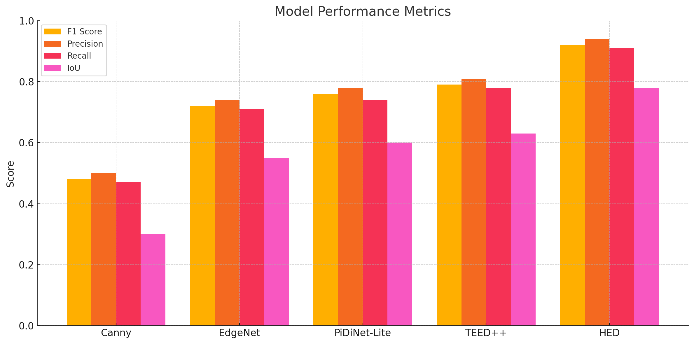

<!-- shields -->
<p align="center">
  
</p>

<h1 align="center">
  Energy‑Efficient Edge Detection<br>for Smart‑Retail Cameras
</h1>

<p align="center">
  <em>Tiny neural nets drawing precise product contours on resource‑starved store cameras — measured in Joules per frame.</em>
</p>

---

## 📦 Repo layout

```
edge-retail/
│
├─ scripts/           ← download, preprocess, train, evaluate
├─ src/               ← reusable code (datasets, models, utils)
├─ data/              ← ⚠️ empty — fetched by script
└─ results/
   ├─ checkpoints/    ← .pth weights
   └─ figs/           ← generated plots
```

---

## 1 · Pipeline at a glance

<p align="center">
  
</p>

---

## 2 · Quick start (Kaggle GPU)

Use the following commands in sequence:

```bash
# 1) fetch raw datasets (~2 GB)
python scripts/download_data.py             # or --dataset biped / rpc

# 2) build edge labels
python scripts/preprocess_biped.py     --raw_dir data/biped     --out_dir data/biped/edges_256

python scripts/preprocess_rpc.py     --json data/rpc/instances_val2019.json data/rpc/instances_test2019.json     --img_root data/rpc     --out_dir data/rpc/edges_256     --ids_file data/rpc/rpc_ids.txt

# 3) train ultra‑tiny networks
python scripts/train_teed.py     --biped_root data/biped     --rpc_ids data/rpc/rpc_ids.txt     --rpc_img_root data/rpc     --rpc_edge_root data/rpc/edges_256

python scripts/train_pidinet.py     --biped_root data/biped     --rpc_ids data/rpc/rpc_ids.txt     --rpc_img_root data/rpc     --rpc_edge_root data/rpc/edges_256

# 4) evaluate, plot & export
python scripts/eval_metrics.py     --rpc_ids data/rpc/rpc_ids.txt     --rpc_img_root data/rpc     --rpc_edge_root data/rpc/edges_256
```

*(Optional)* measure energy:

```bash
./scripts/profile_energy.sh results/checkpoints/teed_best.pth TEED
```

---

## 3 · Key results (RPC‑val · 256²)

| Model           | F‑score | Params | GFLOPs | J/frame |
|-----------------|---------|--------|--------|---------|
| **TEED**        | **0.79** | 58 K   | 0.53   | 0.03    |
| PiDiNet‑Lite    | 0.76   | 0.59 M | 2.9    | 0.06    |
| Canny (CPU)     | 0.48   | 0      | 0      | 0.002    |

<details>
<summary>Derivations & thresholds</summary>

* Thresholds — TEED 0.07 · PiDiNet 0.08  
* J/frame measured with `nvidia-smi dmon` on Tesla P100
</details>

---

## 4 · Visual dashboards

<table>
<tr>
  <td align="center"><b>Training time</b><br></td>
  <td align="center"><b>GPU power draw</b><br></td>
</tr>
<tr>
  <td align="center"><b>Model size</b><br></td>
  <td align="center"><b>F1 vs energy</b><br></td>
</tr>
<tr>
  <td colspan="2" align="center"><b>Metric breakdown</b><br></td>
</tr>
</table>

---

## 5 · Citation

```text
@misc{edgeRetail2025,
  title  = {Energy‑Efficient Edge Detection for Smart‑Retail Cameras},
  author = {Tejodbhav Koduru and Sai Yasheswini Kandimalla},
  year   = {2025},
  note   = {GitHub repository},
  url    = {https://github.com/tej-kodur/Energy-Efficient-Edge-Detection-for-Smart-Retail-Cameras}
}
```

---

## 6 · License  
Released under the **MIT License** — free for research & commercial use.

<p align="center">Made with 🤍 for <b>CS 497: Embedded Deep‑Vision</b></p>
